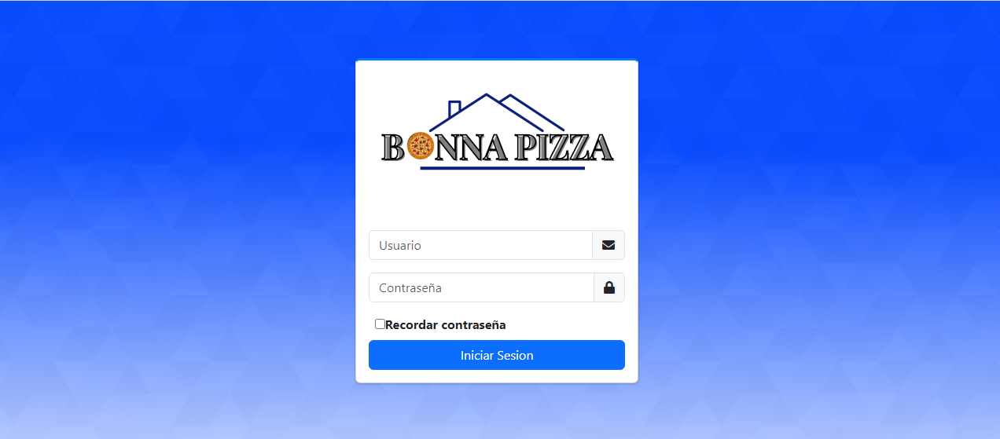
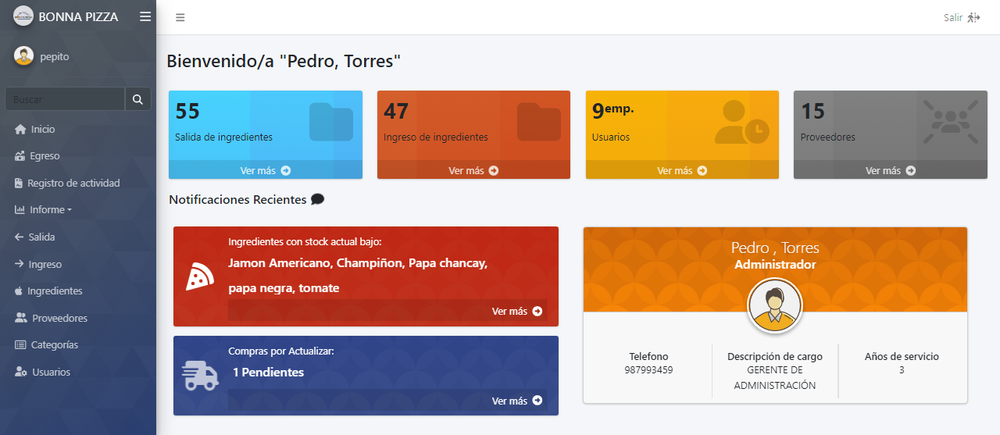
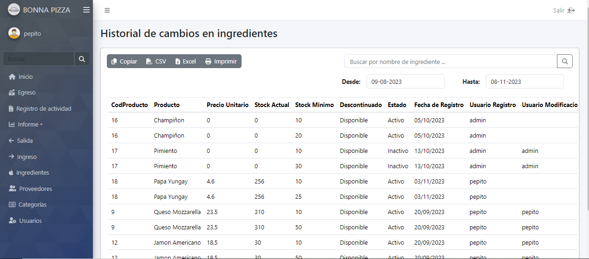
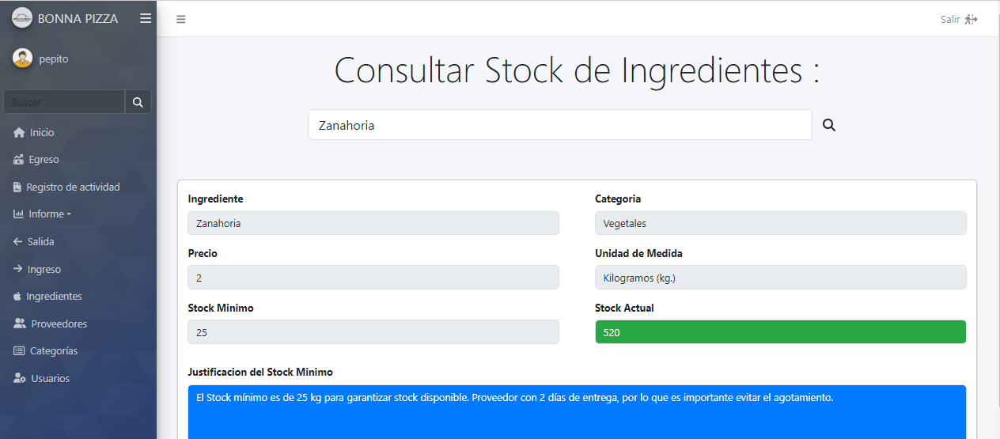

# Bonne Pizza - Plataforma de Gestión de Inventario

Este proyecto fue creado en colaboración y representa la plataforma de gestión de inventario para Bonne Pizza, una pizzería en crecimiento. La aplicación de software integral desarrollada tiene como objetivo mejorar la eficiencia operativa y el servicio al cliente mediante la gestión del inventario y la optimización de la adquisición de insumos.

## Características Principales
1. **Validación y Verificación de Cuentas de Usuario:** La aplicación ofrece un sistema de autenticación seguro para garantizar que solo usuarios autorizados tengan acceso a la plataforma. Esto contribuye significativamente a la seguridad de la aplicación y los datos.

2. **Mantenimiento de Tablas Importantes:** La aplicación permite el mantenimiento de tablas clave, como productos, usuarios y proveedores. Esto facilita la gestión de datos esenciales y garantiza la precisión de la información almacenada.

3. **Visualización de Informes Relevantes:** Los usuarios pueden acceder y visualizar informes importantes para la empresa, como los registros de entrada y salida de productos. Estos informes proporcionan una visión clara de la actividad operativa y ayudan en la toma de decisiones informadas.

4. **Gestión de Stock Mínimo:** La aplicación monitorea el nivel de existencias de los productos y alerta cuando un producto alcanza su stock mínimo. Esta funcionalidad mejora la eficiencia en la gestión de la mercadería y evita problemas de desabastecimiento.

## Principales Capturas

### Captura de login de la página

### Captura de la página principal

### Captura de la sección de informes principales

### Captura de consulta de stock actual

